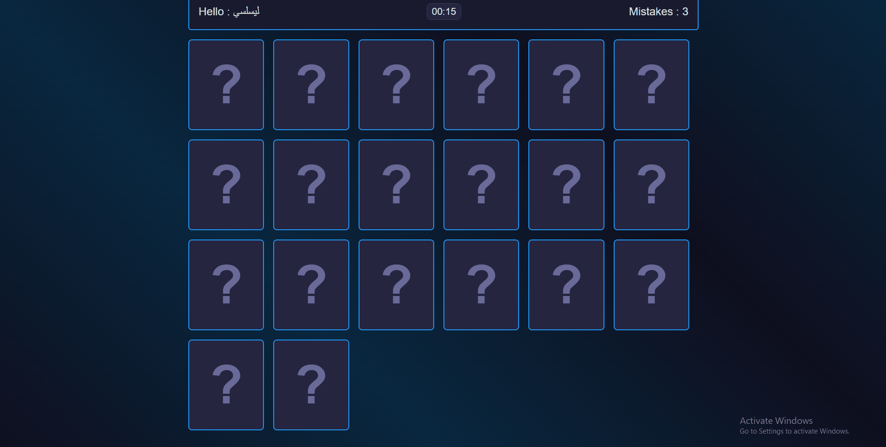
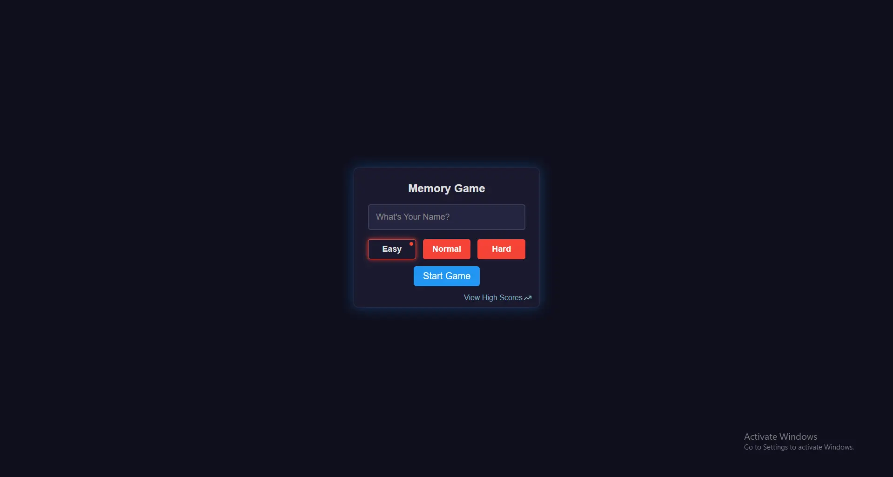
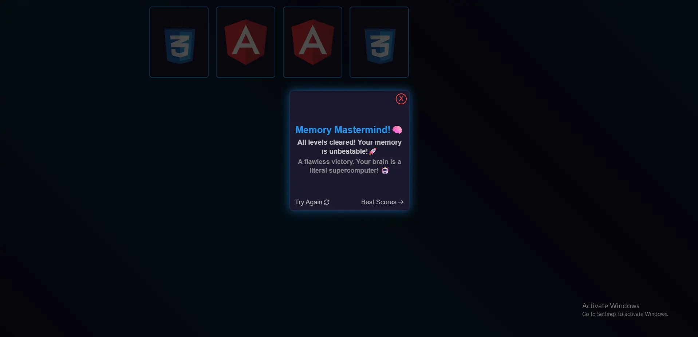

# 🧠 Memory Game

A responsive Memory Card Game built with **HTML**, **CSS**, and **Vanilla JavaScript**.

Players match pairs of technology cards before running out of time or exceeding the allowed number of mistakes. The game includes three difficulty levels, sound effects, animations, and a local leaderboard that stores the best scores using Local Storage.

---

## 🎮 Live Demo

Coming Soon...

---

## ✨ Features

- Three difficulty levels (Easy, Normal, Hard)
- Countdown timer
- Mistake limit for each level
- Responsive design
- Flip card animations
- Sound effects
- Local leaderboard
- High score detection
- Level progression
- Game Over & Win dialogs
- Congratulations screen
- Local Storage support

---

## 🛠 Technologies Used

- HTML5
- CSS3
- Vanilla JavaScript (ES6)

---

## 📷 Screenshots

### Gameplay Action


### Start Menu & Leaderboard & finish Message





---

## 🚀 How to Run

1. Clone the repository.

```bash
git clone https://github.com/basosytech/Basosy-memory-game.git
```

2. Open the project folder.

3. Open `index.html`

or

Run it using **Live Server**.

---

## 📁 Project Structure

```
Memory-Game/
│
├── css/
├── imgs/
├── screenshots/
├── sounds/
├── index.html
├── main.js
└── README.md
```

---


## 📄 License

This project is for learning and portfolio purposes.
